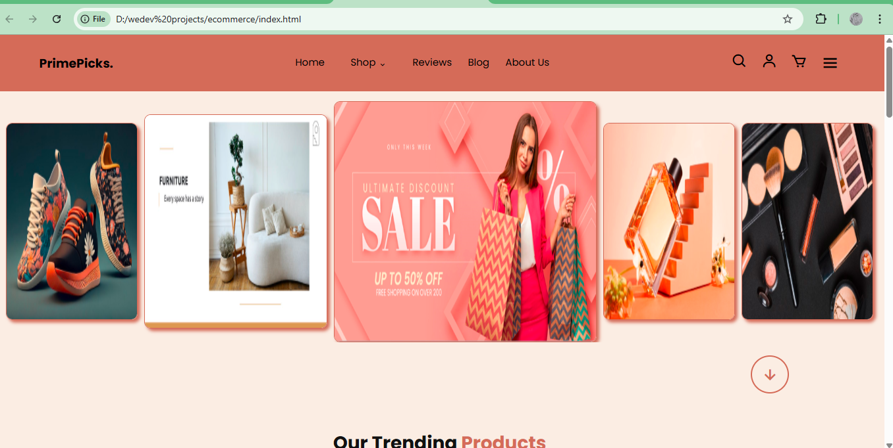
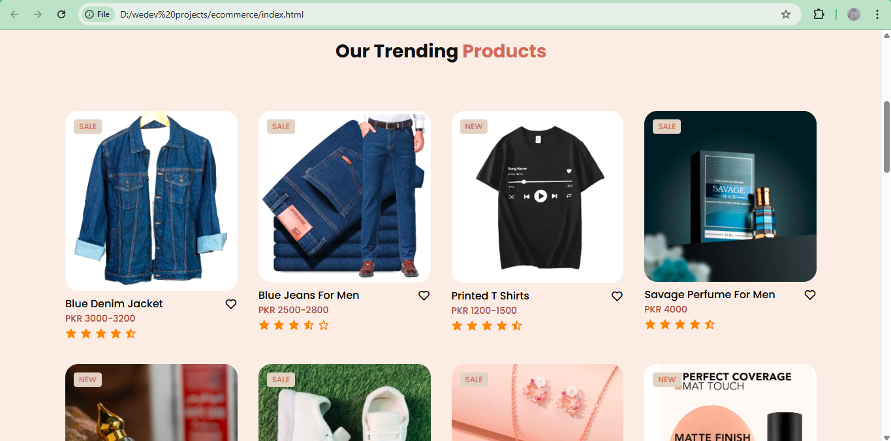
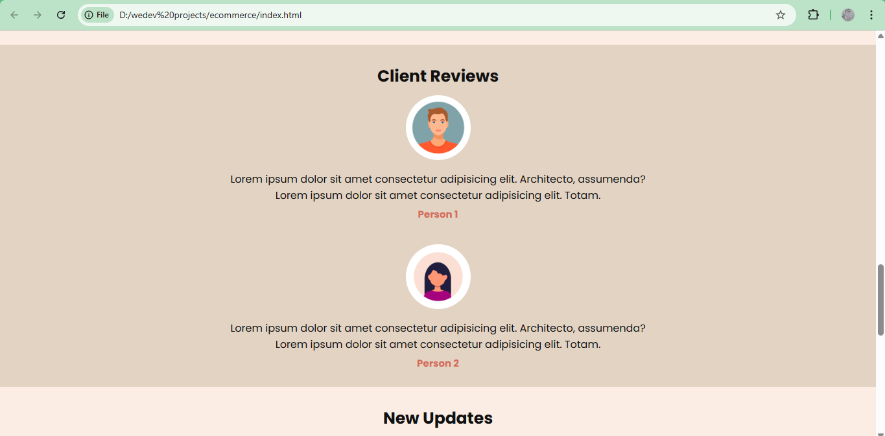
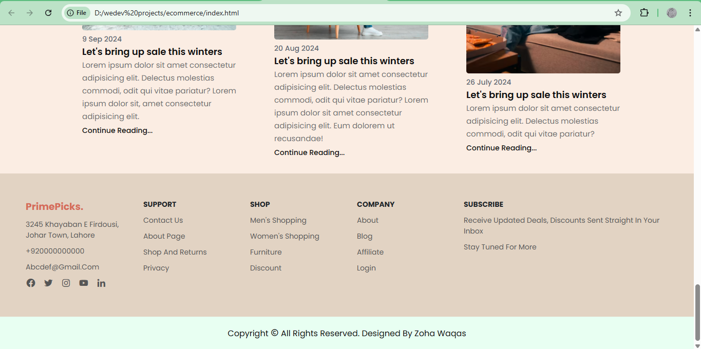

# E-Commerce Website Design

## Description
This project is a responsive **e-commerce website design** developed using pure HTML and CSS. The goal of this project was to practice and demonstrate strong frontend fundamentals, layout structuring, and modern UI effects without relying on external templates or frameworks.

The website includes animated sections, a visually engaging carousel, and multiple e-commerce-related pages to simulate a real online store experience.

---

## Tech Stack
- HTML5  
- CSS3  

---

## Features
- Fully responsive layout  
- Animated carousel using CSS  
- Smooth CSS animations and transitions  
- Product listing and shop layout  
- Customer reviews section  
- Contact page UI  
- Clean and structured UI design  

---

## Screenshots

### Homepage


### Shop Page


### Reviews Section


### Contact Page


---

## Project Purpose
- Strengthen HTML and CSS fundamentals  
- Practice animations and transitions  
- Build a realistic e-commerce UI layout  
- Improve visual hierarchy and responsive design skills  

---

## How to Run Locally
1. Clone the repository:
```bash
git clone https://github.com/yourusername/ecommerce-design.git
